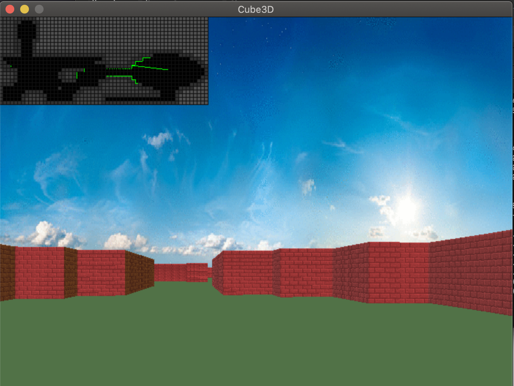
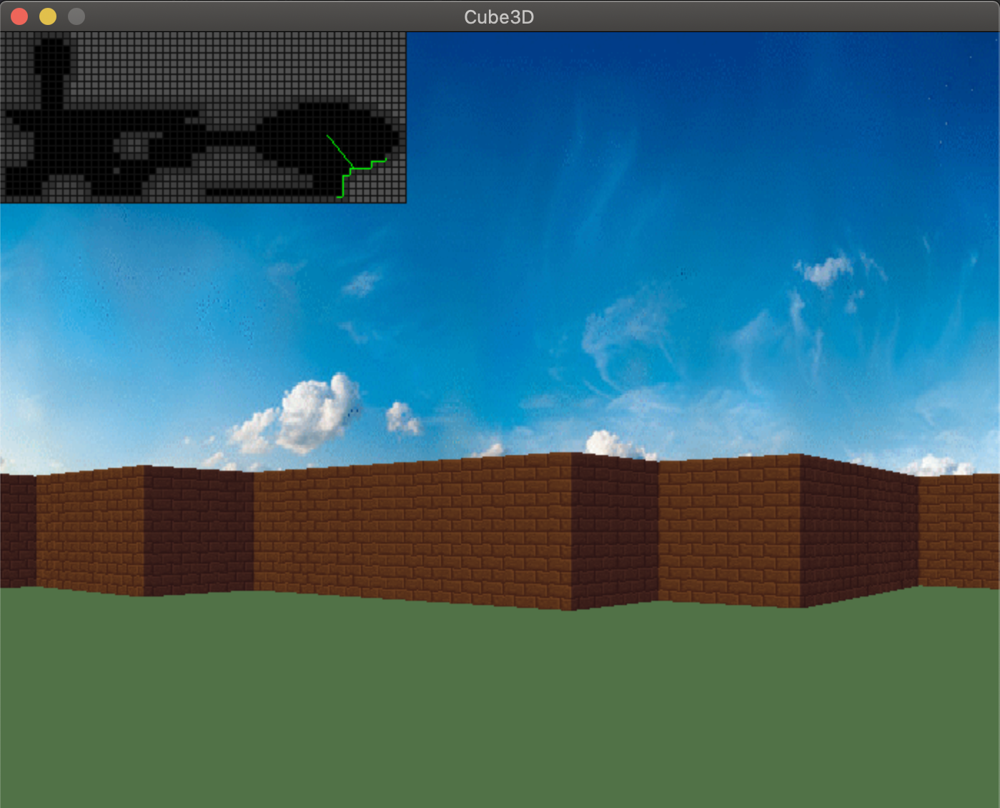
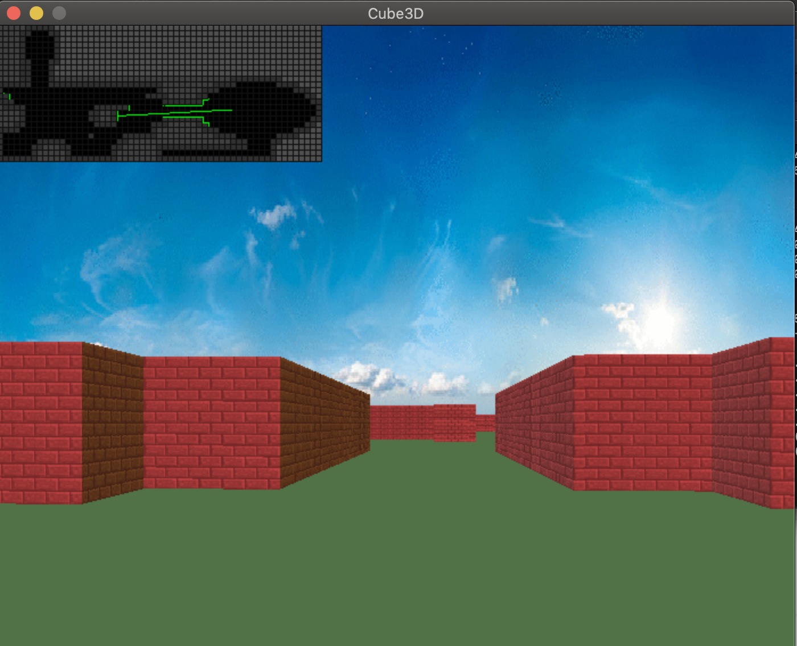
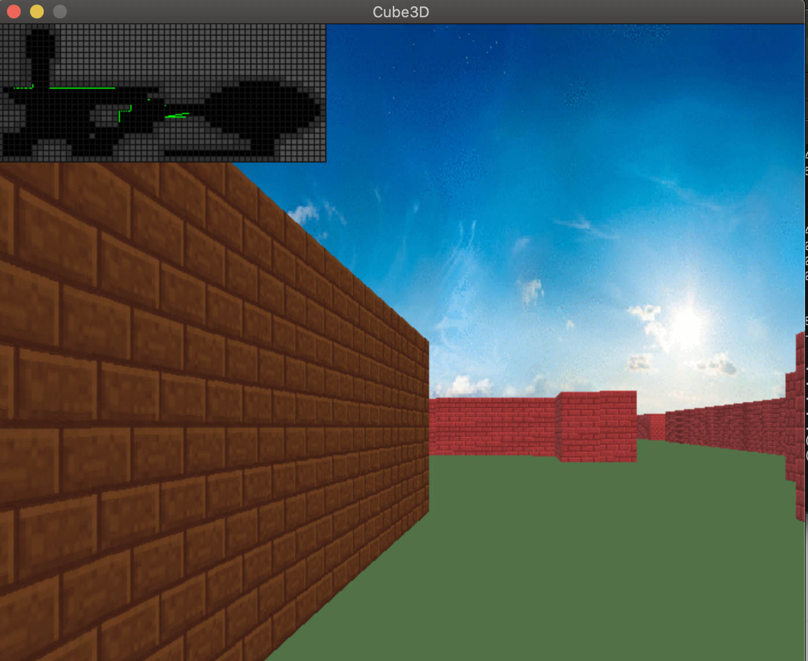
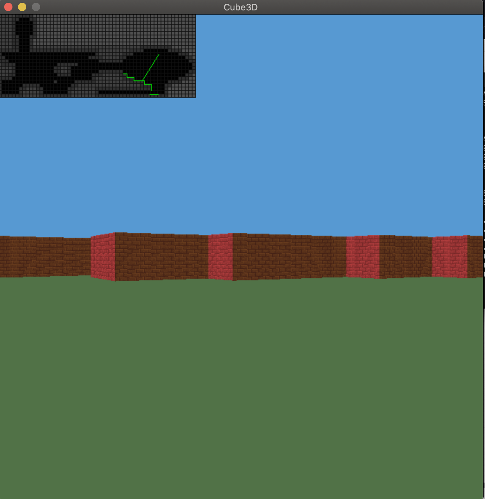

# cub3D - My First RayCaster with miniLibX

## Overview

The cub3D project is inspired by the classic game Wolfenstein 3D and aims to teach the fundamentals of ray-casting by developing a dynamic 3D view inside a maze using the miniLibX library. The project emphasizes graphics programming, algorithmic thinking, and rigorous coding standards.

  
  
  
  

<!--
### Example Image 1:

### Example Image 2:

### Example Image 3:

### Example Image 4:

-->

## Objectives

- Develop skills in C programming, basic algorithms, and information research.
- Learn to handle graphics elements such as windows, colors, events, and shapes.
- Apply mathematical principles to create efficient algorithms without needing in-depth mathematical knowledge.

## Project Requirements

### Code Standards and Norms

- Written in C, adhering to specified coding norms.
- Functions must handle errors gracefully (no unexpected quits).
- Proper memory management (no leaks).
- Submission includes a Makefile with specific rules (all, clean, fclean, re, bonus).

### Mandatory Features

- Create a first-person perspective 3D maze using ray-casting.
- Utilize the miniLibX library for graphics.
- Manage window operations smoothly.
- Implement different wall textures based on orientation (N, S, E, W).
- Set distinct floor and ceiling colors.
- Implement controls: arrow keys for looking around, WASD for movement, ESC for quitting, and window close button functionality.
- Parse a `.cub` file for scene description, ensuring maps are valid and surrounded by walls.

### Bonus Features

- Additional features are evaluated only if the mandatory part is flawless.
- Possible bonuses include wall collisions, a minimap, doors, animated sprites, and mouse-based viewpoint rotation.

## Key Learning Outcomes

- Mastery of C programming and adherence to coding standards.
- Practical experience in graphics programming using miniLibX.
- Application of ray-casting techniques to create a 3D game environment.
- Understanding the importance of rigorous testing and error handling in software development.

### Example Image 5: Bonus Game with a Weapon of Your Choice and the Player Looking at the Ceiling

This project offers a practical and engaging way to explore the intersection of graphics programming and algorithmic problem-solving, providing a strong foundation for future projects in computer graphics and game development.
